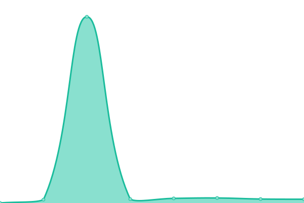

# [📈 Live Status](https://upptime.yayal.cc): <!--live status--> **🟧 Partial outage**

This repository contains the open-source uptime monitor and status page for [RJK](https://www.yayal.cc/), powered by [Upptime](https://github.com/upptime/upptime).

With [Upptime](https://upptime.js.org), you can get your own unlimited and free uptime monitor and status page, powered entirely by a GitHub repository. We use [Issues](https://github.com/Iuleoo/Upptime/issues) as incident reports, [Actions](https://github.com/Iuleoo/Upptime/actions) as uptime monitors, and [Pages](https://upptime.yayal.cc) for the status page.

<!--start: status pages-->
<!-- This summary is generated by Upptime (https://github.com/upptime/upptime) -->
<!-- Do not edit this manually, your changes will be overwritten -->
<!-- prettier-ignore -->
| URL | Status | History | Response Time | Uptime |
| --- | ------ | ------- | ------------- | ------ |
|  [Google](https://www.google.com) | 正常 | [google.yml](https://github.com/Iuleoo/Upptime/commits/HEAD/history/google.yml) | 

 599ms
     
 | 

<a href="https://upptime.yayal.cc/history/google">100.00%</a>
    

|  [Wikipedia](https://zh.wikipedia.org) | 正常 | [wikipedia.yml](https://github.com/Iuleoo/Upptime/commits/HEAD/history/wikipedia.yml) | 

 202ms
     
 | 

<a href="https://upptime.yayal.cc/history/wikipedia">100.00%</a>
    

|  [YAYAL](https://www.yayal.cc) | 中断 | [yayal.yml](https://github.com/Iuleoo/Upptime/commits/HEAD/history/yayal.yml) | 

 0ms
     
 | 

<a href="https://upptime.yayal.cc/history/yayal">0.00%</a>
    

|  Mirrors | 中断 | [mirrors.yml](https://github.com/Iuleoo/Upptime/commits/HEAD/history/mirrors.yml) | 

 0ms
     
 | 

<a href="https://upptime.yayal.cc/history/mirrors">0.00%</a>
    

|  [Cloudflare DNS](1.1.1.1) | 正常 | [cloudflare-dns.yml](https://github.com/Iuleoo/Upptime/commits/HEAD/history/cloudflare-dns.yml) | 

 5ms
     
 | 

<a href="https://upptime.yayal.cc/history/cloudflare-dns">100.00%</a>
    

<!--end: status pages-->

[**Visit our status website →**](https://upptime.yayal.cc)

## 📄 License

- Powered by: [Upptime](https://github.com/upptime/upptime)
- Code: [MIT](./LICENSE) © [Anand Chowdhary](https://anandchowdhary.com), supported by [Pabio](https://pabio.com)
- Data in the `./history` directory: [Open Database License](https://opendatacommons.org/licenses/odbl/1-0/)
